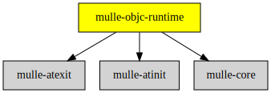

# mulle-objc-runtime

#### ⏩ A fast, portable Objective-C runtime written 100% in C11

A portable Objective-C runtime written in C11. No Assembler required.
It follows the Apple "Objective-C 1 Runtime" and [adds many features](//www.mulle-kybernetik.com/weblog/2015/mulle_objc_present_and_absent.html)
from "Objective-C 2.0", but the runtime function calls are completely different.
It is designed to be suitable for massive multi-threading.


| Release Version                                       | Release Notes
|-------------------------------------------------------|--------------
|  [](//github.com/mulle-objc/mulle-objc-runtime/actions) | [RELEASENOTES](RELEASENOTES.md) |


## API

| Data structure                                       | Description
|------------------------------------------------------|--------------------------------
| [`_mulle_objc_class`](dox/API_CLASS.md)              | Deal with Classes
| [`_mulle_objc_ivar`](dox/API_IVAR.md) et al.         | Instance variables
| [`_mulle_objc_loadinfo`](dox/API_LOADINFO.md)        | Install Classes, Categories, Methods, Strings into the runtime
| [`_mulle_objc_method`](dox/API_METHOD.md)  et al.    | Deal with Methods
| [`_mulle_objc_object`](dox/API_OBJECT.md)  et al.    | Deal with Instances
| [`_mulle_objc_property`](dox/API_PROPERTY.md) et al. | Handle Properties
| [`_mulle_objc_universe`](dox/API_UNIVERSE.md)        | Work with the runtime universe


| Function type                         | Description
|---------------------------------------|-----------------------------------
| [Global Functions](dox/API_GLOBAL.md) | Global functions  and conveniences
| [Exceptions](dox/API_EXCEPTION.md)    | Raising exceptions
| [Vararg extensions](dox/API_VARARG.md)| Dealing with variable arguments


## Usage

If you haven't used an Objective-C runtime before, it is useful to get to know
the much better documented "Mac OS X Objective-C 1.0" runtime first.
[Intro to the Objective-C Runtime](//mikeash.com/pyblog/friday-qa-2009-03-13-intro-to-the-objective-c-runtime.html)
could be a good starting point.


> #### C Caveat
>
> It you use `.c` files that include `<mulle-objc-runtime/mulle-objc-runtime.h>`
> make sure that you compile with `__MULLE_OBJC_TPS__`, `__MULLE_OBJC_NO_TPS__`
> `__MULLE_OBJC_FCS__`  `__MULLE_OBJC_NO_FCS__` as defined when compiling the
> runtime. Since C-only compilations do not emit runtime information,
> mismatches can not be checked by the runtime.
> Easy fix: rename `.c` to `.m` and use **mulle-clang**


## What's so different ?

* Runtime objects (like classes and selectors) are not referenced by name, but
by a unique ID. No special linker action required.

* Parameters outside of `self` and `_cmd` are passed via `_param`, a single
pointer to a struct. This simplifies a lot of code, especially forwarding code.
Return values are also returned with the same struct. Optimizations are done for
simple methods with only none or one parameter and none or one return value.

* It uses inlineable method calls for superior performance. The user can
specify "fast" classes and "fast" methods for extra speed in performance
critical cases.

* `retain`/`release` semantics are built in. These are non-overridable, which
makes them a lot faster.

* `isa` is not part of the instance, but instead prefixed to the instance.

* `Protocol` as a type and an object does not exist anymore. Instead there is
PROTOCOL which is basically the same as SEL and has compiler support.

* No global lock, except when loading code. The runtime in normal operation
only locks during `+initialize` on a per class basis.

* Protections against the fragile base class problem

* Multiple runtimes can coexist in differently named "universes".

### Articles

These articles give you some background about the **mulle-objc** runtime:

1. [mulle-objc: a new Objective-C runtime](//www.mulle-kybernetik.com/weblog/2015/mulle_objc_a_new_objective_c_.html)
2. [mulle-objc: a meta calling convention](//www.mulle-kybernetik.com/weblog/2015/mulle_objc_meta_call_convention.html)
3. [mulle-objc: removing superflous ifs](//www.mulle-kybernetik.com/weblog/2015/mulle_objc_the_superflous_if.html)
3. [mulle-objc: inlined messaging](//www.mulle-kybernetik.com/weblog/2015/mulle_objc_inlined_messaging.html)
4. [mulle-objc: some research about selectors](//www.mulle-kybernetik.com/weblog/2015/mulle_objc_selector_statistics.html)
5. [mulle-objc: hashes for classes, selectors and protocols](//www.mulle-kybernetik.com/weblog/2015/mulle_objc_selectors_are_hashes.html)
6. [mulle_objc: object layout, retain counting, finalize](//www.mulle-kybernetik.com/weblog/2015/mulle_objc_finalize_makes_a_comeback.html)
7. [mulle_objc: inheriting methods from protocols](//www.mulle-kybernetik.com/weblog/2015/mulle_objc_inheriting_from_protocols.html)
8. [mulle_objc: present and absent language features](//www.mulle-kybernetik.com/weblog/2015/mulle_objc_present_and_absent.html)
9. [mulle_objc: the trouble with @property](//www.mulle-kybernetik.com/weblog/2016/mulle_objc_property_trouble.html)
10. [mulle_objc: ivar layout with @property](//www.mulle-kybernetik.com/weblog/2016/mulle_objc_ivar_layout.html)
11. mulle_objc: technically speaking
   1. [mulle-clang, technically speaking](//www.mulle-kybernetik.com/weblog/2016/mulle_objc_clang_technically.html)
   2. [mulle-objc-runtime, technically speaking](//www.mulle-kybernetik.com/weblog/2016/mulle_objc_runtime_technically.html)
   3. [MulleFoundation, technically speaking](//www.mulle-kybernetik.com/weblog/2016/mulle_objc_foundation_technically.html)

If something is unclear, feel free to contact the author.


### You are here




## Requirements

|   Requirement         | Release Version  | Description
|-----------------------|------------------|---------------
| [mulle-core](https://github.com/mulle-core/mulle-core) |  [](https://github.com/mulle-core/mulle-core/actions/workflows/mulle-sde-ci.yml) | 🌋 Almagamated library of mulle-core and mulle-c
| [mulle-atinit](https://github.com/mulle-core/mulle-atinit) |  [](https://github.com/mulle-core/mulle-atinit/actions/workflows/mulle-sde-ci.yml) | 🤱🏼 Compatibility library for deterministic initializers
| [mulle-atexit](https://github.com/mulle-core/mulle-atexit) |  [](https://github.com/mulle-core/mulle-atexit/actions/workflows/mulle-sde-ci.yml) | 👼 Compatibility library to fix atexit


## Add

Use [mulle-sde](//github.com/mulle-sde) to add mulle-objc-runtime to your project.
As long as your sources are using `#include "include-private.h"` and your headers use `#include "include.h"`, there will nothing more to do:

``` sh
mulle-sde add github:mulle-objc/mulle-objc-runtime
```

To only add the sources of mulle-objc-runtime with dependency
sources use [clib](https://github.com/clibs/clib):

## Legacy adds

One common denominator is that you will likely have to add
`#include <mulle-objc-runtime/mulle-objc-runtime.h>` to your source files.


### Add sources to your project with clib

``` sh
clib install --out src/mulle-objc mulle-objc/mulle-objc-runtime
```

Add `-isystem src/mulle-objc` to your `CFLAGS` and compile all the
sources that were downloaded with your project. (In **cmake** add
`include_directories( BEFORE SYSTEM src/mulle-objc)` to your `CMakeLists.txt`
file).


### Add as subproject with cmake and git

``` bash
git submodule add -f --name "mulle-core" \
                            "https://github.com/mulle-core/mulle-core.git" \
                            "stash/mulle-core"
git submodule add -f --name "mulle-atinit" \
                            "https://github.com/mulle-core/mulle-atinit.git" \
                            "stash/mulle-atinit"
git submodule add -f --name "mulle-atexit" \
                            "https://github.com/mulle-core/mulle-atexit.git" \
                            "stash/mulle-atexit"
git submodule add -f --name "mulle-objc-runtime" \
                            "https://github.com/mulle-objc/mulle-objc-runtime" \
                            "stash/mulle-objc-runtime"
git submodule update --init --recursive
```

``` cmake
add_subdirectory( stash/mulle-objc-runtime)
add_subdirectory( stash/mulle-atexit)
add_subdirectory( stash/mulle-atinit)
add_subdirectory( stash/mulle-core)

target_link_libraries( ${PROJECT_NAME} PUBLIC mulle-objc-runtime)
target_link_libraries( ${PROJECT_NAME} PUBLIC mulle-atexit)
target_link_libraries( ${PROJECT_NAME} PUBLIC mulle-atinit)
target_link_libraries( ${PROJECT_NAME} PUBLIC mulle-core)
```


## Install

### Install with mulle-sde

Use [mulle-sde](//github.com/mulle-sde) to build and install mulle-objc-runtime and all dependencies:

``` sh
mulle-sde install --prefix /usr/local \
   https://github.com/mulle-objc/mulle-objc-runtime/archive/latest.tar.gz
```

### Manual Installation

Install the [Requirements](#Requirements) and then
install **mulle-objc-runtime** with [cmake](https://cmake.org):

``` sh
cmake -B build \
      -DCMAKE_INSTALL_PREFIX=/usr/local \
      -DCMAKE_PREFIX_PATH=/usr/local \
      -DCMAKE_BUILD_TYPE=Release &&
cmake --build build --config Release &&
cmake --install build --config Release
```


## Author

[Nat!](https://mulle-kybernetik.com/weblog) for Mulle kybernetiK  


