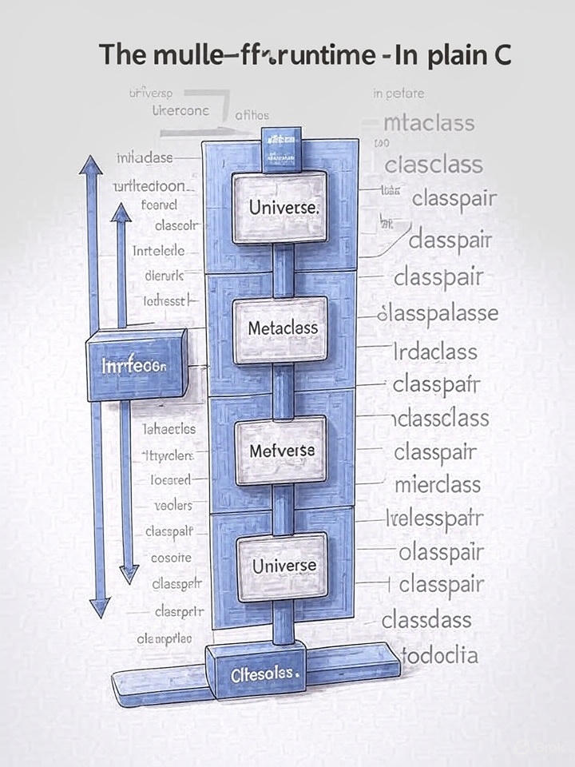

# Chapter 0: Introduction



# The mulle-objc Runtime - in plain C

## About This Book

This book explains the mulle-objc runtime from a C programmer's perspective. Rather than treating Objective-C as a separate language with mystical object-oriented features, we approach it as what it truly is: C with metadata added for introspection and dynamic dispatch.

What Objective-C actually does is elegantly simple:

- **Methods** are just C functions with metadata for introspection
- **Classes** are just C structs with metadata describing their layout and capabilities  
- **Protocols** are tags that can be attached to classes to declare capabilities
- **Properties** are ivars (struct members) combined with getter/setter functions

The entire "magic" of Objective-C is the process of resolving a selector (a unique integer, derived from a string) to the actual C function that implements the method. This resolution handles inheritance, categories, calls to superclasses, and method forwarding - all through a systematic lookup process that ultimately returns a function pointer to call.

The mulle-objc runtime is the engine that performs this resolution and provides the foundation for Objective-C's dynamic features. By understanding this runtime in C terms, you gain complete control over Objective-C's behavior and can debug, optimize, and extend it effectively.

As the runtime is dynamic, you add classes and functions at runtime and
influence the way methods are found.


## How This Book Was Written

This book was developed through an iterative process of documentation and testing. Each chapter started with API exploration, followed by practical examples, then verification through executable test cases. Every code example in this book is a working program that you can compile and run.

The documentation was written alongside the actual runtime implementation, ensuring accuracy. Each chapter contains:

- Direct API explanations without abstraction layers
- Working C code examples (20 lines or less)
- Corresponding test files in `test-compiler-runtime/book/N/`
- Real struct definitions from the runtime headers
- Practical usage patterns from actual runtime code

## Book Structure

| Chapter | Title | Focus |
|---------|--------|--------|
| [Chapter 1](chapter1-fundamentals.md) | Runtime Fundamentals | Basic concepts and universe setup |
| [Chapter 2](chapter2-class-system.md) | The Class System | Class creation, inheritance, and metadata |
| [Chapter 3](chapter3-ivar-system.md) | Instance Variables | Ivar layout, access, and memory management |
| [Chapter 4](chapter4-method-system.md) | The Method System | Method implementation and dispatch |
| [Chapter 5](chapter5-property-system.md) | The Property System | Property attributes and accessor methods |
| [Chapter 6](chapter6-protocol-system.md) | The Protocol System | Protocol definitions and conformance |
| [Chapter 7](chapter7-object-system.md) | The Object System | Instance creation and lifecycle |
| [Chapter 8](chapter8-call-mechanism.md) | The Call Mechanism | Message sending and method lookup |
| [Chapter 9](chapter9-advanced-topics.md) | Advanced Topics | Categories, associated objects, and more |
| [Chapter 10](chapter10-universe-configuration.md) | Universe Configuration | Runtime initialization and configuration |

## Appendix

- **[Appendix A](appendix-a-data-structure-layouts.md)**: Complete data structure layouts from runtime headers
- **[Appendix B](appendix-b-encoding.md)**: Type encodings and method signatures

## Reading This Book

Each chapter builds on the previous ones, but you can jump directly to topics of interest. Every concept is demonstrated with working C code that you can use.

To run any example:

```bash
mulle-sde test run test-compiler-runtime/book/N/filename.m
```

This book assumes basic C knowledge and familiarity with structs, function pointers, and memory management. No prior Objective-C experience is required - we explain all Objective-C concepts in C terms.

## The Runtime Philosophy

The mulle-objc runtime follows these principles:

1. **Transparency**: Everything is inspectable and modifiable
2. **Efficiency**: Minimal overhead for common operations  
3. **Flexibility**: Runtime behavior can be customized
4. **C Integration**: Seamless integration with C code
5. **Debuggability**: Complete visibility into runtime operations

Understanding these principles helps you use the runtime effectively and write better Objective-C code.

---

*Next: [Chapter 1 - Runtime Fundamentals](chapter1-fundamentals.md)*