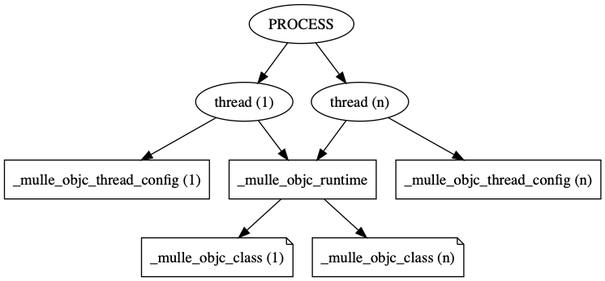

# Runtime

The **mulle-objc** runtime is not a class, but a C struct. It is the root of
everything: classes and instances. In a well constructed mulle-objc runtime
system, every object is reachable from the runtime.

By default there is one global runtime per process. This is the simplest and
most efficient setup.



But the runtime library can also be compiled with
`-DMULLE_OBJC_HAVE_THREAD_LOCAL_RUNTIME` so that each thread has its own
runtime.

This can be beneficial for example if you want to write Objective-C code for
plugins that get dynamically loaded and unloaded (e.g. Apache Web Server)


> **Warning:** The thread local setup hasn't been tested much.
> 
> If you do this and use `mulle_objc_inlined_get_runtime`, all Objective-C 
> code must be compiled with `-DMULLE_OBJC_HAVE_THREAD_LOCAL_RUNTIME`. 
> 


## Functions


### `mulle_objc_get_runtime`

```
struct _mulle_objc_runtime  *mulle_objc_get_runtime( void);
```

Returns the runtime for the current thread. If this thread has no runtime
associated with it, this function may crash.


### `mulle_objc_inlined_get_runtime`

```
struct _mulle_objc_runtime  * mulle_objc_inlined_get_runtime( void);
```

A slightly faster version of above `mulle_objc_get_runtime`. If you use it you
should be aware that your compiled code is committed to using either the global
or the thread local runtime scheme.


### `mulle_objc_runtime_new_classpair`

```
struct _mulle_objc_classpair   *mulle_objc_runtime_new_classpair(
				struct _mulle_objc_runtime *runtime,
				mulle_objc_classid_t  classid,
				char *name,
				size_t instance_size,
				struct _mulle_objc_infraclass *superclass);
```

Create a new `_mulle_objc_classpair`, the class pair is not yet added to the
runtime. The classpair must be added to the runtime, that created it and no
other.

Parametername       |  Description
--------------------|----------------------
`runtime`           | Pointer to the runtime, must not be NULL. Use `__get_or_create_mulle_objc_runtime` (not `mulle_objc_get_runtime`) to get the proper one for your thread
`classid`           | Compute the `classid` from `name` with `mulle_objc_classid_from_string`
`name`              | The name of the class, this must be a non-empty ASCII string. This string is not copied. It must remain alive for the duration of the class's existence.
`instance_size`     | The space needed for instance variables (don't add the header size)
`superclass`        | Class to inherit from, can be NULL for root classes.

Returns NULL on error. Check `errno` for error codes.


### `mulle_objc_runtime_add_infraclass`

```
int   mulle_objc_runtime_add_infraclass( struct _mulle_objc_runtime *runtime,
                                         struct _mulle_objc_infraclass *cls);
```

Add a class `cls` to `runtime`. Returns 0 on success, otherwise check `errno`
for error codes.

> It is generally recommended that you use
> [`_mulle_objc_loadinfo`](API_LOADINFO.md) to add
> classes to the runtime.

Example:

```
struct _mulle_objc_runtime     *runtime;
struct _mulle_objc_classpair   *pair;
struct _mulle_objc_class       *cls;
char                           *name;
mulle_objc_classid_t           classid;

runtime =  __get_or_create_mulle_objc_runtime();
name    = "Foo";
classid = mulle_objc_classid_from_string( name);
pair    = mulle_objc_runtime_new_classpair( runtime, classid, name, 0, NULL);
cls     = mulle_objc_classpair_get_infraclass( pair);
mulle_objc_runtime_add_class( runtime, cls);
```

### `mulle_objc_runtime_get_or_lookup_infraclass`

```
struct _mulle_objc_class  *mulle_objc_runtime_get_or_lookup_class(
                    struct _mulle_objc_runtime *runtime,
                    mulle_objc_classid_t classid)
```

Retrieve class with `classid` from `runtime`. Returns NULL if not found.


### `mulle_objc_runtime_calloc`

```
void   *mulle_objc_runtime_calloc( struct _mulle_objc_runtime *runtime, size_t n, size_t size)
```

`calloc` some memory using the memory allocator of the runtime. This automatically gifts the memory to the runtime!

### `mulle_objc_runtime_realloc`

```
void   *mulle_objc_runtime_realloc( struct _mulle_objc_runtime *runtime, void *block, size_t size)
```

`realloc` some memory using the memory allocator of the runtime.This automatically gifts the memory to the runtime!

