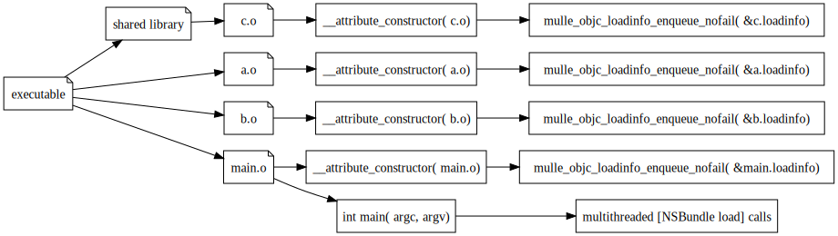
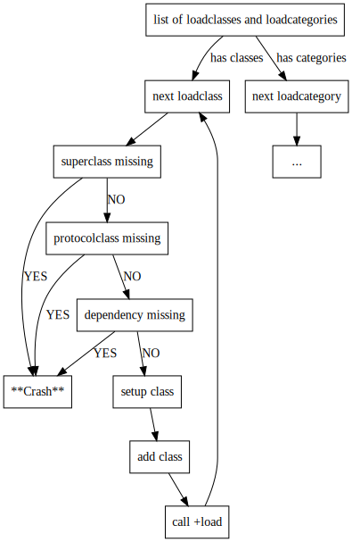
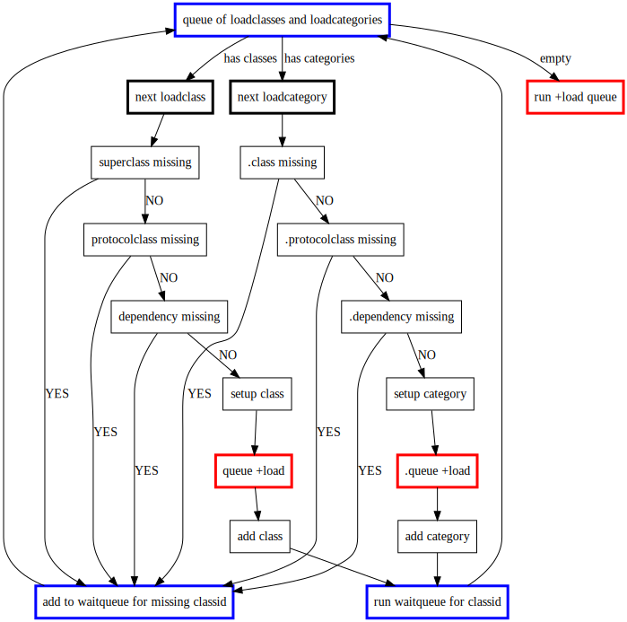
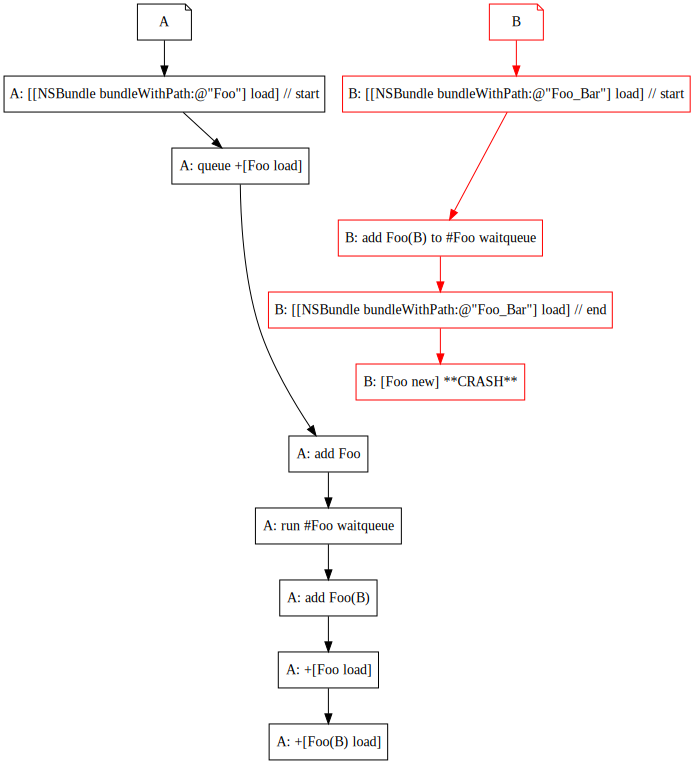

# +load

## How other runtimes handle `+load`

### +load in Apple's runtime:

> The load message is sent to classes and categories that are both dynamically loaded > and statically linked, but only if the newly loaded class or category implements a > method that can respond.
>
> The order of initialization is as follows:
>
>    All initializers in any framework you link to.
>
>    All `+load` methods in your image.
>
>    All C++ static initializers and C/C++ `__attribute__(constructor)` functions in your image.
>
>    All initializers in frameworks that link to you.
>
> In addition:
>
>    A class’s `+load` method is called after all of its superclasses’ `+load` methods.
>
>    A category `+load` method is called after the class’s own `+load` method.
>
> In a custom implementation of load you can therefore safely message other unrelated > classes from the same image, but any load methods implemented by those classes may > not have run yet.

#### Discussion

    1. *All initializers in any framework you link to.*

The framework is always a shared library. A shared-library you link to must
have been loaded before your shared library gets loaded. That's fairly
trivial. What this implicitly guarantees though is, that all `+load` code is
run, and nothing gets delayed.

    2. *All `+load` methods in your image.*
    3. *All C++ static initializers and C/C++ __attribute__(constructor) functions in your image.*

It's a function of the Apple **dyld** linker to prefer `+load` over __attribute__(constructor). Since mulle-objc-runtime load mechanism is based on `__attribute__(constructor)` this is necessarily different.

    4. *All initializers in frameworks that link to you.*

4 follows logically from 1, so it's supeflous

### +load in GNUStep's runtime

> This method is called before the +initialize message is sent to the class, so you  cannot depend on class initialisation having been performed, or upon other classes existing (apart from superclasses of the receiver, since `+load` is called on superclasses before it is called on their subclasses).
> As a gross generalisation, it is safe to use C code, including most ObjectiveC runtime functions within `+load` , but attempting to send messages to ObjectiveC objects is likely to fail.

#### Discussion

GNUStep basically guarantees nothing. `+load`s are performed as they are coming in.

## +load in mulle-objc-runtime

The **mulle-objc-runtime** supports classes, that depend on a superclass and
protocol classes and it supports categories, that additionally depend on other categories of the same class.

> A **class** is created with the information of a **loadclass**, a **category**
> is added with the information of a **loadcategory**. A loadclass or loadcategory
> is called a loadable for short.

If we assume, that the executable is composed of a complete set of loadcategories and loadclasses without missing dependencies, then all classes and categories will be installed ahead of `main`. They get installed via `__attribute__((constructor))` function calls to `mulle_objc_loadinfo_unfailing_enqueue`, the **mulle-clang** compiler emits:

This following diagram charts the loading process of classes and categories, that could be implemented in `mulle_objc_loadinfo_unfailing_enqueue`, if the load-order of `.o` files in an executable was perfectly sorted according to dependencies:

> #### `+load` before or after addition ?
>
> One question is, if `+load` should be called before the class or category is added
> to
> the runtime system or after. If the `+load` is called before the addition, the
> following functionality is unavailable in `+load`:
>
> **Classes**
>
> * you can't message the metaclass. If your class is called "Foo" you can't call `+[Foo ...]`. Obviously your class is not discoverable by other classes.
>
> **Categories**
>
> * you can't message any instance or class-methods, that are part of your category.
>
> This is not desirable and expected by the user (class programmer). Is it avoidable ?

#### Necessity of a wait-queue

The order in which loadables appear in a statically linked
executable is pretty much willy-nilly though.  So it is necessary for the runtime to be able to "wait" for a  loadable, that is required for the loading of a dependent loadable. A simple example is: `@interface Foo : Bar`, but `Foo.o` is linked ahead of `Bar.o`.

This is solved by adding a **wait-queue** where loadables add themselves to wait for one or more specific classes. When a class finally appears in the runtime, the **wait-queue** gets executed and the queued loadables recheck their dependencies.

This works nicely in the single-threaded case and if the executable does not contain circular or missing dependencies.

#### Necessity of a shared wait-queue

A major difficulty arises with the dynamic loading of code, as **mulle-objc** is supposed to be parallel and non-blocking. Two threads could be loading classes and categories at the same time and there could be interdependencies between those classes and categories.

Let's assume we have a thread 'A', that loads class `Foo` and a thread 'B' that loads a category `Foo( Bar)`. If 'B' comes first, then it must wait on 'A' to make class `Foo` available. 'B' adds the classid of the incomplete class `Foo` and a callback to a **wait-queue**. The wait-queue must be shared between 'A' and 'B' otherwise 'B' won't get notified by the addition of `Foo` by 'A'.

A **shared wait-queue** in this setup has the following consequences:

1. The `+load` may be executed on a thread different from the thread that was loading the loadclass or loadcategory from the `.o` file.
2. If a `+load` is executed after the addition of the category or class to the runtime, a category `+load` may execute before a class `+load`. Imagine that after "add class" by thread 'A', thread 'B' steps in and tries to add its category `Foo( Bar)`. 'B' will find the class `Foo` and therefore will add the category, Then 'B' executes `+load` of the `Foo( Bar)`.

#### Trying to fix +load order with a load-queue

We can fix the aforementioned sequencing problem by adding a **load-queue** to the system. `+load`s aren't immediately executed but saved in a queue, to be executed in the proper sequence:

Because the `+load` is queued before the category or class is added to the runtime, the proper sequencing is guaranteed. Also since, the `+load` is called after the addition of the class or category, the class is in a state the user would expect.

The **load-queue** must be worked by a single thread, to ensure proper sequencing, if two threads run the queue, the calling order would be unpredictable. This means a lock! Yes, I said it. A lock.

#### Loading threads must block

If 'B' doesn't block until 'A' makes 'Foo' available, it would run into a missing method:

> This is independent of `+load` being called before or after adding the class/category.

As we need a lock for the load-queue anyway, we can expand thes scope to the waitqueues too. This effectively means that loadables force the participating threads into serial execution for the loading. I think I am OK with that.

#### Other Options

1. Defer the problem to **NSBundle**. What should it do ?

    1.1 Assume that only **NSBundle** uses `dl_load` on Objective-C files

    1.2 Install a callback in the runtime

    1.3 `dl_load` the shared library

    1.4 Query runtime, that all wait-queues and load-queues are empty. If not block the thread.

	1.5 Runtime should call **NSBundle** callback if a wait-queue or load-queue has
been emptied (different thread)

    1.6 **NSBundle** should then unlock the waiting thread.

2. **NSBundle** "calls" the main thread to load the code and waits for a notification to continue. Obviously not that desirable
3. Do not maintain a load-queue. Instead call `+load` **before** the class or category is loaded into the class system.

#### Other Aspects

Other C `__attribute__(constructor)` code and C++ initializers are unsequenced in relationship to `+load`. Shared libraries do not impose a sequencing order nor do they imply `+load` execution guarantees for contained loadable.

In general it is bad style to trigger `+initialize` in your or another classes `+load`, since a category may wish to override it with it's own code.

If a category does override `+initialize`, it should query the state bit with `_mulle_objc_class_get_state_bit( cls, MULLE_OBJC_CACHE_INITIALIZED)` during it's `+ load` and `abort()`, if the bit is set already.

The MulleObjCFoundation for example guarantees, that its classes or categories
do not trigger `+initialize` during `+load`.

A consequence of the lock is, that if you are doing something costly in +load,
you are effectively starving other threads from adding loadables.

### Expected Ruleset

1. A `+load` method is only executed once per class or category
2. The `+load` method of a class is executed before `+initialize` of the class.
3. At `+load` time a class can be sure that:

    3.1 It's superclass is present and has run `+load`

    3.2 All protocolclasses are present and have run `+load`

4. At `+load` time a category can be sure that:

   4.1 It's class is present and has run `+load`

   4.2 All protocolclasses are present and have run `+load`

   4.3 All +categoryDependencies are present and have run `+load`
5. A class or category who's dependencies are not satisfied, is not added to
   the runtime system immediately. Instead its addition is postponed, until
   the requirements are met.
