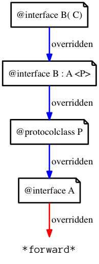

# New search modes `overridden` and `specific`

If we allow the direct chaining of overridden methods, that the runtime already
supports with `mulle_objc_class_method_search` we would get this chain of calls
for each foo doing `MulleObjCLookupOverriddenIMP`:

If there were another protocolclass implementing the same function, it would be
also accessible by `overridden`,

Having `overridden` opens up a whole new range of ways to "piece" classes
together with categories, since you can create initializer and destruction
chains. It is also a nicer way to "wrap" exisiting methods, since you can reuse
the old code.

With `specific` one could pick a specific implementation, maybe to circumvent
a bad category patch.

