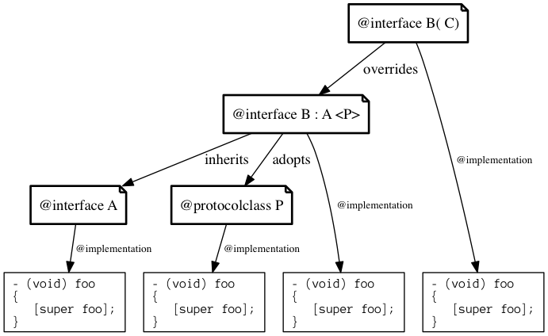
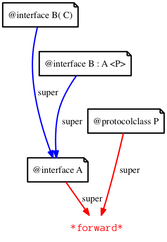
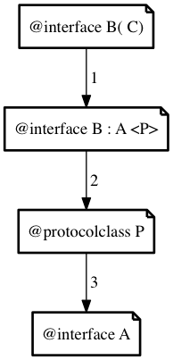
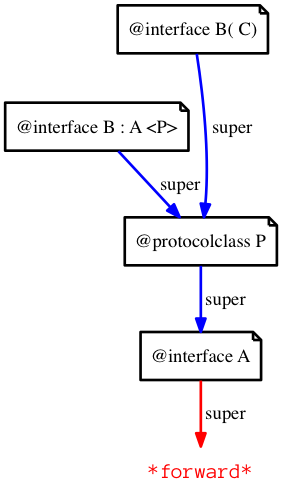

# How `super` works in **mulle-objc**

First for the sake of discussion, lets have a small class system scenario.

1. Class **B** subclasses class **A**. 
2. **B** implements the protocolclass **P**.  
3. Category **B( C)** overrides/supplements **B**. 

Assume each of the `@implementations` of **A**, **B**, **P**, **B(C)** contain a method `-foo`:



#### Root class **A**:

```
@interface A
@end

@implementation A
- (void) foo
{
   [super foo];
}
@end
```

Calling `[super foo]` here is an error, because 'A' does not have a superclass.

#### Protocolclass **P**:

```
@class P;
@protocol P;
@interface P
@end

@implementation P
- (void) foo
{
   [super foo];
}
@end
```

This is also in the classical sense an error, since **P** is a root class.


#### Class **B** inherits **A** and implements **P**:

```
@interface B : A < P>
@end

@implementation B
- (void) foo
{
   [super foo];
}
@end

```


#### Category **B+C** overrides `-foo` of **B**:

```
@implementation B( C)
- (void) foo
{
  [super foo];
}
@end
```


### What would Brian Boitano do ?

When you compile a **super** call for the Apple runtime, the compiler creates a little struct variable:

```
struct objc_super {
    id      receiver;
    Class   super_class;
};
```

And passes the class it knows to be the superclass to the method `objc_msgSendSuper`. 


e.g. 

```
@implementation B

- (void) foo
{
   [super foo];
}
```

would compile to:

```
struct objc_super   super_info = { self, @class( A) };
objc_msgSendSuper( &super_info, _cmd);
```

If mulle-objc were to adapt this scheme, this is what would happen on various stages.



This scheme is obviously fairly static. Protocolclasses will not be found. 
Because protocolclasses are supposed to provide a form of multiple-inheritance, this isn't desirable for mulle-objc.

> If you were to interpose another class 'C' at runtime between 'A' and 'B', 
> the call would not reach that either, which seems unintuitive for a 
> dynamic runtime system. (though hardly a deal breaker)


### What mulle-objc does 

First consider how a method `-bar` will be searched by the runtime for an 
instance of class **B**. Since `-bar` doesn't exist, the search path will 
be traveled completely:





The **mulle-objc** compiler passes the classid of the calling class instead. The lookup, what is considered to be the proper recipient of **super** is deferred to the runtime.

The example above compiles to:

```
mulle_objc_supercall_classid( self, _cmd, _param, @selector( B));
```

Since **mulle-objc** has protocolclasses and wants to support multiple inheritance,
a super call goes through the protocol classes before reaching the actual superclass. This is the ideal chain of calls for each foo doing 
`[super foo]` in the mulle-objc runtime:





`[super foo]` will work fine in categories and subclasses. It does not work in root classes. And a protocolclass is a root class.

**P** as a root class can not know, that there is something "above" it and that it implements the method `-foo`. 

Instead protocolclasses must first check, that there is a recipient implementing the method and then call it. This is done in C with `MulleObjCLookupSuperIMP`.


## So what is different now ?

You call `[super]` like before. Only if you're implementing a protocol class, you will have to think about your methods being chained methods like f.e. `-handleEvent:` or terminal methods like `-getColor:`. If you want to chain, you write

```
@implementation P

- (id) chain:(id) obj
{
   IMP   imp;
   id    value;

   value = nil;
      
   imp = MulleObjCLookupSuperIMP( self, _cmd, @selector( P));
   if( imp)
      value = (*imp)( self, _cmd, obj);
   ...
}    
```

